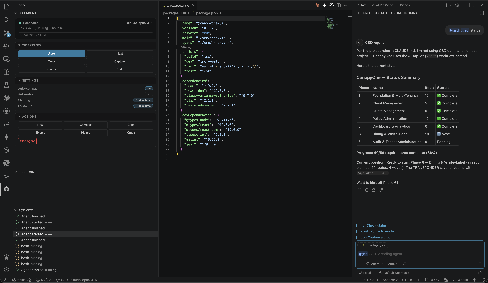

# TAC-2 — VS Code Extension

Control the [TAC-2 coding agent](https://github.com/waghelapritesh/tac-2) directly from VS Code. Run autonomous coding sessions, chat with `@tac`, monitor agent activity in real-time, review and accept/reject changes, and manage your workflow — all without leaving the editor.



## Requirements

- **TAC-2** installed globally: `npm install -g tac-2`
- **Node.js** >= 22.0.0
- **Git** installed and on PATH
- **VS Code** >= 1.95.0

## Quick Start

1. Install TAC: `npm install -g tac-2`
2. Install this extension
3. Open a project folder in VS Code
4. Click the **TAC icon** in the Activity Bar (left sidebar)
5. Click **Start Agent** or run `Ctrl+Shift+P` > **TAC: Start Agent**
6. Start chatting with `@tac` in Chat or click **Auto** in the sidebar

---

## Features

### Sidebar Dashboard

Click the **TAC icon** in the Activity Bar. The compact header shows connection status, model, session, message count, thinking level, context usage bar, and cost — all in two lines. Sections (Workflow, Stats, Actions, Settings) are collapsible and remember their state.

### Workflow Controls

One-click buttons for TAC's core commands. All route through the Chat panel so you see the full response:

| Button | What it does |
|--------|-------------|
| **Auto** | Start autonomous mode — research, plan, execute |
| **Next** | Execute one unit of work, then pause |
| **Quick** | Quick task without planning (opens input) |
| **Capture** | Capture a thought for later triage |

### Chat Integration (`@tac`)

Use `@tac` in VS Code Chat (`Cmd+Shift+I`) to talk to the agent:

```
@tac refactor the auth module to use JWT
@tac /tac auto
@tac fix the errors in this file
```

- **Auto-starts** the agent if not running
- **File context** via `#file` references
- **Selection context** — automatically includes selected code
- **Diagnostic context** — auto-includes errors/warnings when you mention "fix" or "error"
- **Streaming** progress, file anchors, token usage footer

### Source Control Integration

Agent-modified files appear in a dedicated **"TAC Agent"** section of the Source Control panel:

- **Click any file** to see a before/after diff in VS Code's native diff editor
- **Accept** or **Discard** changes per-file via inline buttons
- **Accept All** / **Discard All** via the SCM title bar
- Gutter diff indicators (green/red bars) show exactly what changed

### Line-Level Decorations

When the agent modifies a file, you'll see:
- **Green background** on newly added lines
- **Yellow background** on modified lines
- **Left border gutter indicator** on all agent-touched lines
- **Hover** any decorated line to see "Modified by TAC Agent"

### Checkpoints & Rollback

Automatic checkpoints are created at the start of each agent turn. Use **Discard All** in the SCM panel to revert all agent changes to their original state, or discard individual files.

### Activity Feed

The **Activity** panel shows a real-time log of every tool the agent executes — Read, Write, Edit, Bash, Grep, Glob — with status icons (running/success/error), duration, and click-to-open for file operations.

### Sessions

The **Sessions** panel lists all past sessions for the current workspace. Click any session to switch to it. The current session is highlighted green. Sessions persist to disk automatically.

### Diagnostic Integration

- **Fix Errors** button in the sidebar reads the active file's diagnostics from the Problems panel and sends them to the agent
- **Fix All Problems** (`Cmd+Shift+P` > TAC: Fix All Problems) collects errors/warnings across the workspace
- Works automatically in chat — mention "fix" or "error" and diagnostics are included

### Code Lens

Four inline actions above every function and class (TS/JS/Python/Go/Rust):

| Action | What it does |
|--------|-------------|
| **Ask TAC** | Explain the function/class |
| **Refactor** | Improve clarity, performance, or structure |
| **Find Bugs** | Review for bugs and edge cases |
| **Tests** | Generate test coverage |

### Git Integration

- **Commit Agent Changes** — stages and commits modified files with your message
- **Create Branch** — create a new branch for agent work
- **Show Diff** — view git diff of agent changes

### Approval Modes

Control how much autonomy the agent has:

| Mode | Behavior |
|------|----------|
| **Auto-approve** | Agent runs freely (default) |
| **Ask** | Prompts before file writes and commands |
| **Plan-only** | Read-only — agent can analyze but not modify |

Change via Settings section or `Cmd+Shift+P` > **TAC: Select Approval Mode**.

### Agent UI Requests

When the agent needs input (questions, confirmations, selections), VS Code dialogs appear automatically — no more hanging on `ask_user_questions`.

### Additional Features

- **Conversation History** — full message viewer with tool calls, thinking blocks, search, and fork-from-here
- **Slash Command Completion** — type `/` for auto-complete of `/tac` commands
- **File Decorations** — "G" badge on agent-modified files in the Explorer
- **Bash Terminal** — dedicated terminal for agent shell output
- **Context Window Warning** — notification when context exceeds threshold
- **Progress Notifications** — optional notification with cancel button (off by default)

---

## All Commands

| Command | Shortcut | Description |
|---------|----------|-------------|
| **TAC: Start Agent** | | Connect to the TAC agent |
| **TAC: Stop Agent** | | Disconnect the agent |
| **TAC: New Session** | `Cmd+Shift+G` `Cmd+Shift+N` | Start a fresh conversation |
| **TAC: Send Message** | `Cmd+Shift+G` `Cmd+Shift+P` | Send a message to the agent |
| **TAC: Abort** | `Cmd+Shift+G` `Cmd+Shift+A` | Interrupt the current operation |
| **TAC: Steer Agent** | `Cmd+Shift+G` `Cmd+Shift+I` | Steering message mid-operation |
| **TAC: Switch Model** | | Pick a model from QuickPick |
| **TAC: Cycle Model** | `Cmd+Shift+G` `Cmd+Shift+M` | Rotate to the next model |
| **TAC: Set Thinking Level** | | Choose off / low / medium / high |
| **TAC: Cycle Thinking** | `Cmd+Shift+G` `Cmd+Shift+T` | Rotate through thinking levels |
| **TAC: Compact Context** | | Trigger context compaction |
| **TAC: Export HTML** | | Save session as HTML |
| **TAC: Session Stats** | | Display token usage and cost |
| **TAC: Run Bash** | | Execute a shell command |
| **TAC: List Commands** | | Browse slash commands |
| **TAC: Set Session Name** | | Rename current session |
| **TAC: Copy Last Response** | | Copy to clipboard |
| **TAC: Switch Session** | | Load a different session |
| **TAC: Show History** | | Open conversation viewer |
| **TAC: Fork Session** | | Fork from a previous message |
| **TAC: Fix Problems in File** | | Send file diagnostics to agent |
| **TAC: Fix All Problems** | | Send workspace errors to agent |
| **TAC: Commit Agent Changes** | | Git commit modified files |
| **TAC: Create Branch** | | Create branch for agent work |
| **TAC: Show Agent Diff** | | View git diff |
| **TAC: Accept All Changes** | | Accept all SCM changes |
| **TAC: Discard All Changes** | | Revert all agent modifications |
| **TAC: Select Approval Mode** | | Choose auto-approve/ask/plan-only |
| **TAC: Cycle Approval Mode** | | Rotate through approval modes |
| **TAC: Code Lens** actions | | Ask, Refactor, Find Bugs, Tests |

> On Windows/Linux, replace `Cmd` with `Ctrl`.

## Configuration

| Setting | Default | Description |
|---------|---------|-------------|
| `tac.binaryPath` | `"tac"` | Path to the TAC binary |
| `tac.autoStart` | `false` | Start agent on extension activation |
| `tac.autoCompaction` | `true` | Automatic context compaction |
| `tac.codeLens` | `true` | Code lens above functions/classes |
| `tac.showProgressNotifications` | `false` | Progress notification (off — Chat shows progress) |
| `tac.activityFeedMaxItems` | `100` | Max items in Activity feed |
| `tac.showContextWarning` | `true` | Warn when context exceeds threshold |
| `tac.contextWarningThreshold` | `80` | Context % that triggers warning |
| `tac.approvalMode` | `"auto-approve"` | Agent permission mode |

## How It Works

The extension spawns `tac --mode rpc` and communicates over JSON-RPC via stdin/stdout. Agent events stream in real-time. The change tracker captures file state before modifications for SCM diffs and rollback. UI requests from the agent (questions, confirmations) are handled via VS Code dialogs.

## Links

- [TAC Documentation](https://github.com/waghelapritesh/tac-2/tree/main/docs)
- [Getting Started](https://github.com/waghelapritesh/tac-2/blob/main/docs/getting-started.md)
- [Issue Tracker](https://github.com/waghelapritesh/tac-2/issues)
